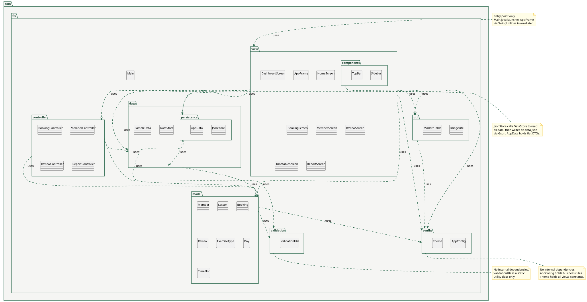

  
  <h1>Furzefield Leisure Centre</h1>
  
<em>Group exercise booking management system</em>

  
  
  
  

---

## Package diagram

**What this shows:** The layered architecture of the application - how the seven packages relate to each other and which direction dependencies flow. Confirms that `view` never communicates directly with `data`, and that `model` has no outward dependencies.

---

---

## Packages

| Package | Responsibility |
|---|---|
| `com.flc.model` | Plain domain objects - `Member`, `Lesson`, `Booking`, `Review`, `ExerciseType`, `Day`, `TimeSlot`. No dependencies on any other package. |
| `com.flc.controller` | Business logic layer - `BookingController`, `MemberController`, `ReviewController`, `ReportController`. Depends on `model` and `data`. |
| `com.flc.data` | In-memory store (`DataStore` singleton), sample data loader (`SampleData`), and JSON persistence (`JsonStore`, `AppData` DTOs). Depends on `model`. |
| `com.flc.view` | All Swing screens - `HomeScreen`, `DashboardScreen`, `BookingScreen`, `MemberScreen`, `ReviewScreen`, `TimetableScreen`, `ReportScreen`. Depends on `controller`, `model`, `data`, `config`, and `util`. |
| `com.flc.config` | Application-wide constants - `AppConfig` (business rules and text), `Theme` (all colours, fonts, and spacing). No dependencies. |
| `com.flc.validation` | `ValidationUtil` - reusable validation methods used by controllers. No dependencies. |
| `com.flc.util` | UI utilities - `ImageUtil` (image loading and tinting), `ModernTable` (table factory and renderers). Depends on `config`. |

## Dependency rules

- `model` has zero outward dependencies - it is the stable core
- `controller` depends on `model` and `data` only - never on `view`
- `view` is the only layer allowed to depend on `controller`
- `config` and `validation` are depended on by others but depend on nothing themselves
- Dependency direction is always inward - outer layers depend on inner layers, never the reverse

---

[Back to diagram index](README.md)
